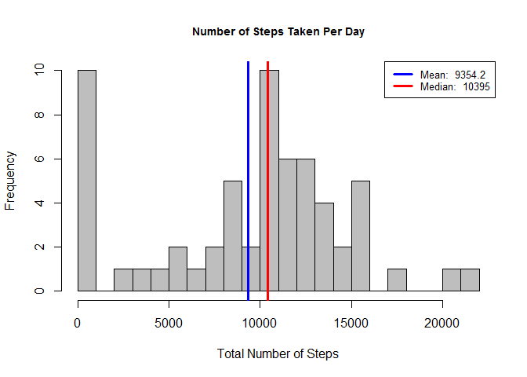
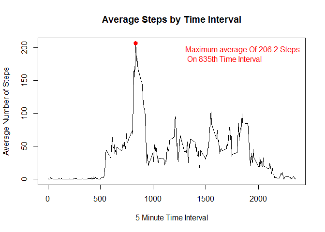
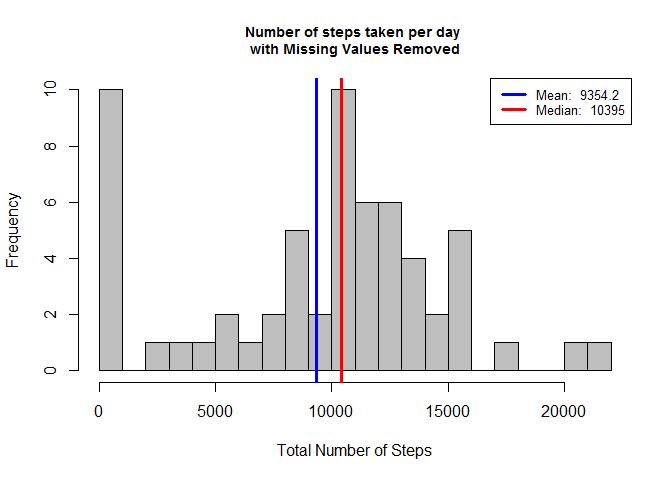
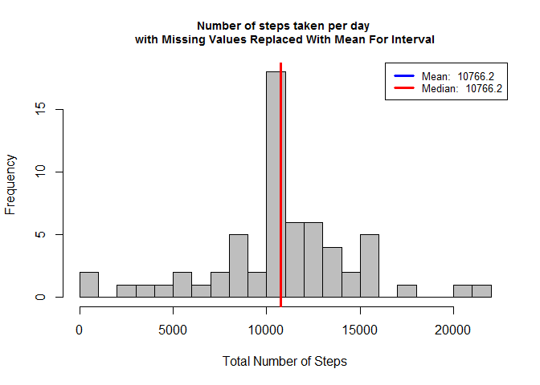

# Reproducible Data - Assignment 1 - Activity Tracker
Priyank Devenraj  
October 18, 2015  

## Introduction
It is now possible to collect a large amount of data about personal movement using activity monitoring devices such as a [Fitbit](http://www.fitbit.com), [NikeFuelband](http://www.nike.com/us/en_us/c/nikeplus-fuelband), or [JawboneUp](https://jawbone.com/up). These type of devices are part of the "quantified self" movement -- a group of enthusiasts who take measurements about themselves regularly to improve their health, to find patterns in their behavior, or because they are tech geeks. But these data remain under-utilized both because the raw data are hard to obtain and there is a lack of statistical methods and software for processing and interpreting the data.  

This assignment makes use of data from a personal activity monitoring device. This device collects data at 5 minute intervals through out the day. The data consists of two months of data from an anonymous individual collected during the months of October and November, 2012 and include the number of steps taken in 5 minute intervals each day.  

## Data
The data for this assignment can be downloaded from the course web site:
* Dataset: [Activity monitoring data](https://d396qusza40orc.cloudfront.net/repdata%2Fdata%2Factivity.zip) [52K]

The variables included in this dataset are:  
* **steps**: Number of steps taking in a 5-minute interval (missing values are coded as `NA`)  
* **date**: The date on which the measurement was taken in YYYY-MM-DD format  
* **interval**: Identifier for the 5-minute interval in which measurement was taken  

The dataset is stored in a comma-separated-value (CSV) file and there are a total of 17,568 observations in this dataset.  

## Loading and preprocessing the data
First, we read this CSV format data into a data.frame, and inspect the structure of the data


```r
activityData = read.csv('activity.csv', header = TRUE) # load data
head(activityData)
```

```
##   steps       date interval
## 1    NA 2012-10-01        0
## 2    NA 2012-10-01        5
## 3    NA 2012-10-01       10
## 4    NA 2012-10-01       15
## 5    NA 2012-10-01       20
## 6    NA 2012-10-01       25
```

```r
str(activityData)
```

```
## 'data.frame':	17568 obs. of  3 variables:
##  $ steps   : int  NA NA NA NA NA NA NA NA NA NA ...
##  $ date    : Factor w/ 61 levels "2012-10-01","2012-10-02",..: 1 1 1 1 1 1 1 1 1 1 ...
##  $ interval: int  0 5 10 15 20 25 30 35 40 45 ...
```

We notice that the Date format can be preprocessed for easier handling

```r
activityData$date <- as.POSIXct(activityData$date) # set the dates to POSIXct
str(activityData)
```

```
## 'data.frame':	17568 obs. of  3 variables:
##  $ steps   : int  NA NA NA NA NA NA NA NA NA NA ...
##  $ date    : POSIXct, format: "2012-10-01" "2012-10-01" ...
##  $ interval: int  0 5 10 15 20 25 30 35 40 45 ...
```

## What is mean total number of steps taken per day?

For this part of the assignment, you can ignore the missing values in
the dataset.

1. Make a histogram of the total number of steps taken each day
2. Calculate and report the **mean** and **median** total number of steps taken per day

So we will make a histogram of the total number of steps taken each day, for which, first we should summarize the data by date:


```r
library(data.table) # data.table helps grouping data easier than data.frame
```

```
## Warning: package 'data.table' was built under R version 3.1.3
```

```r
activityData_tbl = data.table(activityData)
activityData_tbl_summary_date = activityData_tbl[, list(total_steps = sum(steps, na.rm = TRUE)), by = date]
```

**Make The Histogram, And Report on Mean and Median:**

1.  Make a histogram of the total number of steps taken each day
2.  Calculate and report the mean and median total number of steps taken per day

***Note: Mean and Median Are Reported In Legend Of Histogram***  

```r
#Making The Generation of This Plot Into A Function So I Can Re-use Later
gen_hist = function(x, title){
  hist(x, 
      breaks = 30,
      main = title,
      xlab = 'Total Number of Steps', col = 'grey',
      cex.main = .9
  )
     
  #caluclate mean and median
  mean_value = round(mean(x), 1)
  median_value = round(median(x), 1)
      
  #place lines for mean and median on histogram
  abline(v=mean_value, lwd = 3, col = 'blue')
  abline(v=median_value, lwd = 3, col = 'red')
      
  #create legend
  legend('topright', lty = 1, lwd = 3, col = c("blue", "red"),
        cex = .8, 
        legend = c(paste('Mean: ', mean_value),
        paste('Median: ', median_value))
  )
}

#Calling the funcion to generate Histogram
gen_hist(activityData_tbl_summary_date$total_steps, 'Number of Steps Taken Per Day')
```

 
---

## What is the average daily activity pattern?

1. Make a time series plot (i.e. `type = "l"`) of the 5-minute interval (x-axis) and the average number of steps taken, averaged across all days (y-axis)
2. Which 5-minute interval, on average across all the days in the dataset, contains the maximum number of steps?


```r
#summarize dataset (loaded as data.table) by "interval""
activityData_tbl_summary_interval = activityData_tbl[, list(avg_steps = mean(steps, na.rm = TRUE)), by = interval]

#plot the time series
with(activityData_tbl_summary_interval, {
        plot(interval, 
             avg_steps, 
             type = 'l',
             main = 'Average Steps by Time Interval',
             xlab = '5 Minute Time Interval',
             ylab = 'Average Number of Steps')
        })

#Find Interval That Has The Maximum Avg Steps
max_steps = activityData_tbl_summary_interval[which.max(avg_steps), ]

#Generate Label String
max_lab = paste('Maximum average Of ', round(max_steps$avg_steps, 1), ' Steps \n On ', max_steps$interval, 'th Time Interval', sep = '')

#Collect Cooridinates of The Max Interval For Graphing
points(max_steps$interval,  max_steps$avg_steps, col = 'red', lwd = 3, pch = 19)

#Add Label To Annotate Maximum # Steps And Interval
legend("topright",
       legend = max_lab,
       text.col = 'red',
       bty = 'n'
       )
```

 
---
## Imputing missing values

Note that there are a number of days/intervals where there are missing
values (coded as `NA`). The presence of missing days may introduce
bias into some calculations or summaries of the data.

1. Calculate and report the total number of missing values in the dataset (i.e. the total number of rows with `NA`s)

2. Devise a strategy for filling in all of the missing values in the dataset. The strategy does not need to be sophisticated. For example, you could use the mean/median for that day, or the mean for that 5-minute interval, etc.

3. Create a new dataset that is equal to the original dataset but with the missing data filled in.

4. Make a histogram of the total number of steps taken each day and Calculate and report the **mean** and **median** total number of steps taken per day. Do these values differ from the estimates from the first part of the assignment? What is the impact of imputing missing data on the estimates of the total daily number of steps?

#### Part-1:

```r
missingValuesCount <- sum(is.na(activityData$steps)) # calculate missing values
```
The total number of missing values in the dataset ('NA') = **2304**.

#### Part-2 & Part-3:
Now we will attempt to fill in the NA values using the strategy: **"Replace the NA(s) with the mean number of steps for that interval"**.

```r
# First, create a new data.table "activityData_tbl_miss", by adding a "avg_steps" column to the original "activityData_tbl" data.table, for each interval. This is done by soting, and then merging "activityData_tbl" & "activityData_tbl_summary_interval" data.table(s).

setkey(activityData_tbl, interval) #Sort original data.table by "interval" column
setkey(activityData_tbl_summary_interval, interval) #Sort interval-summarized data.table by "interval" column

#Create function that will return the second value if the first value is NA
NA_replace =  function(x,y){
                if(is.na(x)){
                  return(y)
                }
                return(x)
              }

#merge data.table into new "activityData_tbl_miss"
activityData_tbl_miss = activityData_tbl[activityData_tbl_summary_interval]

#In this new data.table, add nother column "new_steps", which has been impuded for missing steps, with mean-steps, for a given interval
activityData_tbl_miss$new_steps = mapply(NA_replace,activityData_tbl_miss$steps, activityData_tbl_miss$avg_steps)

#summaryize new dataset by date
activityData_tbl_summary_date_miss = activityData_tbl_miss[, list(new_steps = sum(new_steps, na.rm = TRUE)), by = date]

#Inspect new dataset
str(activityData_tbl_summary_date_miss)
```

```
## Classes 'data.table' and 'data.frame':	61 obs. of  2 variables:
##  $ date     : POSIXct, format: "2012-10-01" "2012-10-02" ...
##  $ new_steps: num  10766 126 11352 12116 13294 ...
##  - attr(*, ".internal.selfref")=<externalptr>
```

```r
#Preview new dataset
head(activityData_tbl_summary_date_miss)
```

```
##          date new_steps
## 1: 2012-10-01  10766.19
## 2: 2012-10-02    126.00
## 3: 2012-10-03  11352.00
## 4: 2012-10-04  12116.00
## 5: 2012-10-05  13294.00
## 6: 2012-10-06  15420.00
```

#### Part-4:
***Note: Mean and Median Are Reported In Legend Of Histogram***

```r
gen_hist(activityData_tbl_summary_date$total_steps, 'Number of steps taken per day \nwith Missing Values Removed')
```

 

```r
gen_hist(activityData_tbl_summary_date_miss$new_steps, 'Number of steps taken per day \nwith Missing Values Replaced With Mean For Interval')
```

 
---
**Question:** What is the impact of imputing missing data on the estimates of the total daily number of steps?  
**Answer:** The effect is that the the mean & meadian now are same after imputing NA values.  

## Are there differences in activity patterns between weekdays and weekends?

For this part the `weekdays()` function may be of some help here. Use
the dataset with the filled-in missing values for this part.

1. Create a new factor variable in the dataset with two levels -- "weekday" and "weekend" indicating whether a given date is a weekday or weekend day.

```r
#Make Function To Return Either "Weekday" or "Weekend"
fnWeekpart =  function(x){
              if(x %in% c('Saturday', 'Sunday')){
                return('Weekend')
              }
              return('Weekday')
            }

#Add Name of Week
activityData_tbl_miss$dayname = weekdays(as.Date(activityData_tbl_miss$date))

#Add Factor Variable To Differentiate Weekday and Weekend
activityData_tbl_miss$daytype = as.factor(apply(as.matrix(activityData_tbl_miss$dayname), 1, fnWeekpart))

#Summarize Dataset: Mean grouped by interval and daytype
activityData_tbl_summary_intv_daytype_miss = activityData_tbl_miss[, list(avg_steps = mean(new_steps, na.rm = TRUE)), by = list(interval, daytype)]

#Inspect dataset
str(activityData_tbl_summary_intv_daytype_miss)
```

```
## Classes 'data.table' and 'data.frame':	576 obs. of  3 variables:
##  $ interval : int  0 0 5 5 10 10 15 15 20 20 ...
##  $ daytype  : Factor w/ 2 levels "Weekday","Weekend": 1 2 1 2 1 2 1 2 1 2 ...
##  $ avg_steps: num  2.2512 0.2146 0.4453 0.0425 0.1732 ...
##  - attr(*, ".internal.selfref")=<externalptr>
```

```r
#Preview new dataset
head(activityData_tbl_summary_intv_daytype_miss, 20)
```

```
##     interval daytype   avg_steps
##  1:        0 Weekday 2.251153040
##  2:        0 Weekend 0.214622642
##  3:        5 Weekday 0.445283019
##  4:        5 Weekend 0.042452830
##  5:       10 Weekday 0.173165618
##  6:       10 Weekend 0.016509434
##  7:       15 Weekday 0.197903564
##  8:       15 Weekend 0.018867925
##  9:       20 Weekday 0.098951782
## 10:       20 Weekend 0.009433962
## 11:       25 Weekday 1.590356394
## 12:       25 Weekend 3.511792453
## 13:       30 Weekday 0.692662474
## 14:       30 Weekend 0.066037736
## 15:       35 Weekday 1.137945493
## 16:       35 Weekend 0.108490566
## 17:       40 Weekday 0.000000000
## 18:       40 Weekend 0.000000000
## 19:       45 Weekday 1.796226415
## 20:       45 Weekend 0.558962264
```

2. Make a panel plot containing a time series plot (i.e. `type = "l"`) of the 5-minute interval (x-axis) and the average number of steps taken, averaged across all weekday days or weekend days (y-axis). The plot should look something like the following, which was created using **simulated data**:

```r
library(lattice)
xyplot(avg_steps~interval | daytype, data = activityData_tbl_summary_intv_daytype_miss,
      type = 'l',
      xlab = 'Interval',
      ylab = 'Number of Steps',
      layout = c(1,2))
```

 
---
**Conclusion:** From the panel plot, it appears that the WEEKENDS tend to have more number of steps throughout the day, as compared to WEEKDAYS. The only interval when WEEKDAYS have more steps compared to WEEKENDS is at the start of the day.
